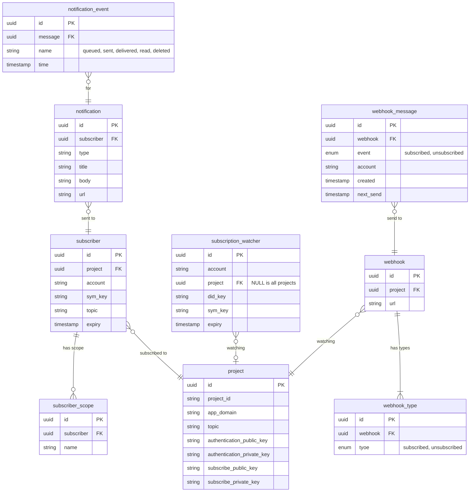

# ERD

```mermaid
erDiagram
    project {
        uuid id PK
        string project_id
        string app_domain
        string topic
        string authentication_public_key
        string authentication_private_key
        string subscribe_public_key
        string subscribe_private_key
    }

    subscriber {
        uuid id PK
        uuid project FK
        string account
        string sym_key
        string topic
        timestamp expiry
    }
    subscriber }o--|| project : "subscribed to"

    subscriber_scope {
        uuid id PK
        uuid subscriber FK
        string name
    }
    subscriber ||--o{ subscriber_scope : "has scope"

    subscription_watcher {
        uuid id PK
        string account
        uuid project FK "NULL is all projects"
        string did_key
        string sym_key
        timestamp expiry
    }
    subscription_watcher }o--o| project : "watching"

    notification {
        uuid id PK
        uuid subscriber FK
        string type
        string title
        string body
        string url
    }
    notification }o--|| subscriber : "sent to"

    notification_event {
        uuid id PK
        uuid message FK
        string name "queued, sent, delivered, read, deleted"
        timestamp time
    }
    notification_event }o--|| notification : "for"

    webhook {
        uuid id PK
        uuid project FK
        string url
    }
    webhook }o--|| project : "watching"

    webhook_type {
        uuid id PK
        uuid webhook FK
        enum tyoe "subscribed, unsubscribed"
    }
    webhook ||--|{ webhook_type : "has types"

    webhook_message {
        uuid id PK
        uuid webhook FK
        enum event "subscribed, unsubscribed"
        string account
        timestamp created
        timestamp next_send
    }
    webhook_message }o--|| webhook : "send to"
```
